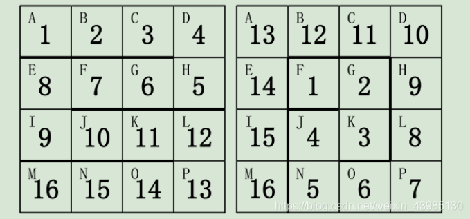

# 蓝桥杯2020国赛C、C++ B组
## 目录 :clipboard:

-   [A 美丽的 2](#A-美丽的-2)
-   [B 扩散](#B-扩散)
-   [C 阶乘约数](#-C-阶乘约数)
-   [D 本质上升序列](#-D-本质上升序列)
-   [E 玩具蛇](#-E-玩具蛇)

## A 美丽的 2

### 题目

小蓝特别喜欢 2，今年是公元 2020 年，他特别高兴。
他很好奇，在公元 1 年到公元 2020 年（包含）中，有多少个年份的数位中包含数字 2？

### 我的答案
```plt
563
```
-   [python 代码](./A_beautiful_2.py)

## B 扩散

### 问题描述
小蓝在一张无限大的特殊画布上作画。
这张画布可以看成一个方格图，每个格子可以用一个二维的整数坐标表示。
小蓝在画布上首先点了一下几个点：
(0, 0), (2020, 11), (11, 14), (2000, 2000)。
只有这几个格子上有黑色，其它位置都是白色的。
每过一分钟，黑色就会扩散一点。具体的，如果一个格子里面是黑色，它
就会扩散到上、下、左、右四个相邻的格子中，使得这四个格子也变成黑色
（如果原来就是黑色，则还是黑色）。
请问，经过 2020 分钟后，画布上有多少个格子是黑色的

### 我的答案
20312088
### 代码
-   [区分内点和边界点](./B_spread.py)
```plt
python B_spread.py  94.97s user 4.04s system 58% cpu 2:49.59 total
```
-   [曼哈顿距离(方格距离)](./B_spread_Manhattan_distance.c)

```plt
0.14s user 0.00s system 98% cpu 0.146 total
```

## C 阶乘约数

### 问题描述
定义阶乘 n! = 1 × 2 × 3 × · · · × n。
请问 100! （100 的阶乘）有多少个约数。

### 我的分析

-   [公式渲染(github不支持latex，这里仅供备份)](https://demo.hedgedoc.org/zxlG6B8HReu6b-EO6vUuzA#%E8%AF%95%E9%A2%98-C-%E9%98%B6%E4%B9%98%E7%BA%A6%E6%95%B0)

```markdown
设
$100!
= p_{1}^{n_{1}} p_{2}^{n_{2}}
\cdots p_{m}^{n_{m}}$

1. $p_i(i=1,\dots,m) \leq 100$
证明：
假设$\exists i,p_i > 100$
由于$p_i | 100!$,
$\exists n \in \{1,2,\dots,100\}$,
$p_i | n$,
$p_i \leq n_i \leq 100$,与假设矛盾

2. 求$n_i(i=1,\dots,m)$
设 $k=\prod_{i=1}^{n} p_i^{n^{(k)}_i}$
$$
  \begin{aligned}
    100! &= \prod_{k=1}^{100} k \\
      &= \prod_{k=1}^{100}
        \prod_{i=1}^{n} p_i^{n^{(k)}_i} \\
      &= \prod_{i=1}^{n} p_i^{n_i} \\
  \end{aligned}
$$
其中
$$
n_i = \sum_{k=1}^{100} n_i^{k}
$$
3. 最终100!的所有因数为 $\prod_{i=1}^m (1+n_i)$
```

### 我的答案
```plt
39001250856960000
```

-   [C_factors.py](./C_factors.py)

## D 本质上升序列

### 问题描述
小蓝特别喜欢单调递增的事物。
在一个字符串中，如果取出若干个字符，
将这些字符按照在字符串中的顺序排列后是单调递增的，则成为这个字符串中的一个单调递增子序列。
例如，
在字符串`lanqiao`中，如果取出字符 n 和 q，
则`nq`组成一个单调递增子序列。
类似的单调递增子序列还有 `lnq`、`i`、`ano` 等等。
小蓝发现，有些子序列虽然位置不同，但是字符序列是一样的，
例如取第二个字符和最后一个字符可以取到 `ao`，
取最后两个字符也可以取到 `ao`。
小蓝认为他们并没有本质不同。
对于一个字符串，
小蓝想知道，
本质不同的递增子序列有多少个？
例如，对于字符串 `lanqiao`，本质不同的递增子序列有 21 个。
它们分别是
```plt
l、a、n、q、i、o、ln、an、lq、aq、nq、ai、lo、ao、no、io、lnq、
anq、lno、ano、aio。
```
请问对于以下字符串
```plt
tocyjkdzcieoiodfpbgcncsrjbhmugdnojjddhllnofawllbhf
iadgdcdjstemphmnjihecoapdjjrprrqnhgccevdarufmliqij
gihhfgdcmxvicfauachlifhafpdccfseflcdgjncadfclvfmad
vrnaaahahndsikzssoywakgnfjjaihtniptwoulxbaeqkqhfwl
```
本质不同的递增子序列有多少个？


### 思路

### 我的答案
```plt
3616159
```
-   [D_increase_sequence](./D_increase_sequence.py)

## E: 玩具蛇

### 问题描述
小蓝有一条玩具蛇，一共有 16 节，
上面标着数字 1 至 16。
每一节都是一个正方形的形状。
相邻的两节可以成直线或者成 90 度角。
小蓝还有一个 4×4 的方格盒子，用于存放玩具蛇，
盒子的方格上依次标着字母 A 到 P 共 16 个字母。
小蓝可以折叠自己的玩具蛇放到盒子里面。他发现，有很多种方案可以将
玩具蛇放进去。
下图给出了两种方案：



请帮小蓝计算一下，总共有多少种不同的方案。如果两个方案中，
存在玩具蛇的某一节放在了盒子的不同格子里，则认为是不同的方案。

### 我的答案
```plt
552
```

### 代码
-   [E_toy_snake.py](./E_toy_snake)

## 参考
-   [第十一届蓝桥杯国赛C语言组B类B题扩散](https://blog.csdn.net/bdu_zhangAo/article/details/109715079)
-   [第十一届蓝桥杯国赛C++B组C题阶乘约数](https://blog.csdn.net/Steve_Liu12399/article/details/109731270)
-   [11届国赛python试题 D: 本质上升序列](https://www.jianshu.com/p/31cd66789a99)
-   [2020第十一届蓝桥杯大赛软件类国赛题目 C/C++ B 组](https://blog.csdn.net/weixin_43985130/article/details/109695805)
