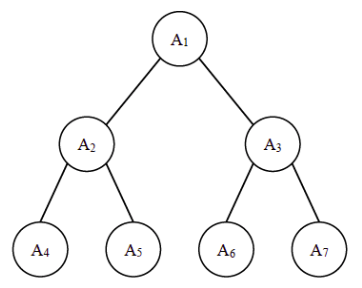

# 蓝桥杯2019省赛B组
## 目录 :clipboard:

-   [A 组队](#A-组队)
-   [B 年号字串](#B-年号字串)
-   [C 数列求值](#C-数列求值)
-   [D 数的分解](#D-数的分解)
-   [E 迷宫](#E-迷宫)
-   [F 特别数的和](#F-特别数的和)
-   [G 完全二叉树的权值](#G-完全二叉树的权值)
-   [H 等差数列](#H-等差数列)
-   [I 后缀表达式](#I-后缀表达式)
-   [J 灵能传输](#J-灵能传输)

## A 组队
作为篮球队教练，你需要从以下名单中选出 1 号位至 5 号位各一名球员，
组成球队的首发阵容。
每位球员担任 1 号位至 5 号位时的评分如下表所示。请你计算首发阵容 1
号位至 5 号位的评分之和最大可能是多少？

| 编号 | 1号位 | 2号位 | 3号位 | 4号位 | 5号位 |
|:---- |:----- | ----- | ----- | ----- | ----- |
| 1    | 97    | 90    | 0     | 0     | 0     |
| 2    | 92    | 85    | 96    | 0     | 0     |
| 3    | 0     | 0     | 0     | 0     | 93    |
| 4    | 0     | 0     | 0     | 80    | 86    |
| 5    | 89    | 83    | 97    | 0     | 0     |
| 6    | 82    | 86    | 0     | 0     | 0     |
| 7    | 0     | 0     | 0     | 87    | 90    |
| 8    | 0     | 97    | 96    | 0     | 0     |
| 9    | 0     | 0     | 89    | 0     | 0     |
| 10   | 95    | 99    | 0     | 0     | 0     |
| 11   | 0     | 0     | 96    | 97    | 0     |
| 12   | 0     | 0     | 0     | 93    | 98    |
| 13   | 94    | 91    | 0     | 0     | 0     |
| 14   | 0     | 83    | 87    | 0     | 0     |
| 15   | 0     | 0     | 98    | 97    | 98    |
| 16   | 0     | 0     | 0     | 93    | 86    |
| 17   | 98    | 83    | 99    | 98    | 81    |
| 18   | 93    | 87    | 92    | 96    | 98    |
| 19   | 0     | 0     | 0     | 89    | 92    |
| 20   | 0     | 99    | 96    | 95    | 81    |

答案 *490*

| 编号 | 1号位  | 2号位  | 3号位  | 4号位  | 5号位  |
|:---- |:------ | ------ | ------ | ------ | ------ |
| 1    | **97** | 90     | 0      | 0      | 0      |
| 2    | 92     | 85     | 96     | 0      | 0      |
| 3    | 0      | 0      | 0      | 0      | 93     |
| 4    | 0      | 0      | 0      | 80     | 86     |
| 5    | 89     | 83     | 97     | 0      | 0      |
| 6    | 82     | 86     | 0      | 0      | 0      |
| 7    | 0      | 0      | 0      | 87     | 90     |
| 8    | 0      | 97     | 96     | 0      | 0      |
| 9    | 0      | 0      | 89     | 0      | 0      |
| 10   | 95     | **99** | 0      | 0      | 0      |
| 11   | 0      | 0      | 96     | 97     | 0      |
| 12   | 0      | 0      | 0      | 93     | 98     |
| 13   | 94     | 91     | 0      | 0      | 0      |
| 14   | 0      | 83     | 87     | 0      | 0      |
| 15   | 0      | 0      | 98     | **97** | 98     |
| 16   | 0      | 0      | 0      | 93     | 86     |
| 17   | 98     | 83     | **99** | 98     | 81     |
| 18   | 93     | 87     | 92     | 96     | **98** |
| 19   | 0      | 0      | 0      | 89     | 92     |
| 20   | 0      | 99     | 96     | 95     | 81     |

## B 年号字串
-   [代码](B_year_to_char.c)

本题总分：5 分

小明用字母 `A` 对应数字 `1`，`B` 对应 `2`，以此类推，用 `Z` 对应 `26`。对于 `27`
以上的数字，小明用两位或更长位的字符串来对应，例如 `AA` 对应 `27`，`AB` 对
应 `28`，`AZ` 对应 `52`，`LQ` 对应 `329`。
请问 2019 对应的字符串是什么？

【答案提交】
这是一道结果填空的题，你只需要算出结果后提交即可。本题的结果为一
个大写英文字符串，在提交答案时只填写这个字符串，注意全部大写，填写多
余的内容将无法得分。

### 我的答案
```plt
BYQ
```

## C 数列求值
-   [代码](C_fib.c)

本题总分：10 分

给定数列` 1, 1, 1, 3, 5, 9, 17, …，`从第 4 项开始，每项都是前 3 项的和。求
第 `20190324` 项的最后 `4` 位数字。
【答案提交】
这是一道结果填空的题，你只需要算出结果后提交即可。本题的结果为一
个 4 位整数（提示：答案的千位不为 0） ，在提交答案时只填写这个整数，填写
多余的内容将无法得分。

我的答案
```plt
4659
```

## D 数的分解
本题总分：10 分

-   [代码](sum3.c)

【问题描述】
把 2019 分解成 3 个各不相同的正整数之和，并且要求每个正整数都不包
含数字 2 和 4，一共有多少种不同的分解方法？
注意交换 3 个整数的顺序被视为同一种方法，例如 1000+1001+18 和
1001+1000+18 被视为同一种。
【答案提交】
这是一道结果填空的题，你只需要算出结果后提交即可。本题的结果为一
个整数，在提交答案时只填写这个整数，填写多余的内容将无法得分。

我的答案
```plt
40785
```

## E 迷宫
-   [代码](E_maze.c)

本题总分：15 分

【问题描述】

下图给出了一个迷宫的平面图，其中标记为 1 的为障碍，标记为 0 的为可以通行的地方。
```plaintext
010000
000100
001001
110000
```
迷宫的入口为左上角，出口为右下角，在迷宫中，只能从一个位置走到这个它的上、下、左、右四个方向之一。
对于上面的迷宫，从入口开始，可以按DRRURRDDDR 的顺序通过迷宫，一共 10 步。其中 D、U、L、R 分别表示向下、向上、向左、向右走。

对于下面这个更复杂的迷宫（30 行 50 列） ，请找出一种通过迷宫的方式，其使用的步数最少，在步数最少的前提下，请找出字典序最小的一个作为答案。
请注意在字典序中D<L<R<U。（如果你把以下文字复制到文本文件中，请务必检查复制的内容是否与文档中的一致。在试题目录下有一个文件 maze.txt，
内容与下面的文本相同）
```plaintext
01010101001011001001010110010110100100001000101010
00001000100000101010010000100000001001100110100101
01111011010010001000001101001011100011000000010000
01000000001010100011010000101000001010101011001011
00011111000000101000010010100010100000101100000000
11001000110101000010101100011010011010101011110111
00011011010101001001001010000001000101001110000000
10100000101000100110101010111110011000010000111010
00111000001010100001100010000001000101001100001001
11000110100001110010001001010101010101010001101000
00010000100100000101001010101110100010101010000101
11100100101001001000010000010101010100100100010100
00000010000000101011001111010001100000101010100011
10101010011100001000011000010110011110110100001000
10101010100001101010100101000010100000111011101001
10000000101100010000101100101101001011100000000100
10101001000000010100100001000100000100011110101001
00101001010101101001010100011010101101110000110101
11001010000100001100000010100101000001000111000010
00001000110000110101101000000100101001001000011101
10100101000101000000001110110010110101101010100001
00101000010000110101010000100010001001000100010101
10100001000110010001000010101001010101011111010010
00000100101000000110010100101001000001000000000010
11010000001001110111001001000011101001011011101000
00000110100010001000100000001000011101000000110011
10101000101000100010001111100010101001010000001000
10000010100101001010110000000100101010001011101000
00111100001000010000000110111000000001000000001011
10000001100111010111010001000110111010101101111000
```
【答案提交】

这是一道结果填空的题，你只需要算出结果后提交即可。本题的结果为一个字符串，包含四种字母 D、U、L、R，在提交答案时只填写这个字符串，填写多余的内容将无法得分。

## F 特别数的和
-  [代码](F_special_sum.c)

时间限制: 1.0s 内存限制: 256.0MB 本题总分：15 分

【问题描述】
小明对数位中含有 2、0、1、9 的数字很感兴趣（不包括前导 0） ，在 1 到
40 中这样的数包括 1、2、9、10 至 32、39 和 40，共 28 个，他们的和是 574。
请问，在 1 到 n 中，所有这样的数的和是多少？

【输入格式】

输入一行包含两个整数 n。

【输出格式】

输出一行，包含一个整数，表示满足条件的数的和。

【样例输入】
```plt
40
```
【样例输出】
```plt
574
```
【评测用例规模与约定】
```plt
对于 20% 的评测用例，1 ≤ n ≤ 10。
对于 50% 的评测用例，1 ≤ n ≤ 100。
对于 80% 的评测用例，1 ≤ n ≤ 1000。
对于所有评测用例，1 ≤ n ≤ 10000。
```


## G 完全二叉树的权值

-  [代码](G_binary_tree_weight.c)

时间限制: `1.0s` 内存限制: `256.0MB` 本题总分：20 分

【问题描述】

给定一棵包含 N 个节点的完全二叉树，树上每个节点都有一个权值，按从
上到下、从左到右的顺序依次是 A<sub>1</sub> , A<sub>2</sub> , ··· A<sub>N</sub> ，
如下图所示：




现在小明要把相同深度的节点的权值加在一起，他想知道哪个深度的节点
权值之和最大？如果有多个深度的权值和同为最大，请你输出其中最小的深度。
注：根的深度是 1。
【输入格式】
第一行包含一个整数 `N`。
第二行包含 `N` 个整数 A <sub>1</sub> , A <sub>2</sub> , ··· A <sub>N</sub> 。

【输出格式】

输出一个整数代表答案。

【样例输入】
```plt
7
1 6 5 4 3 2 1
```
【样例输出】
```plt
2
```
【评测用例规模与约定】
对于所有评测用例，`1 ≤ N ≤ 100000`，`−100000 ≤ A i ≤ 100000。`

## H 等差数列
-  [代码](H_arithmetic_progression.c)

数学老师给小明出了一道等差数列求和的题目。但是粗心的小明忘记了一部分的数列，只记得其中 N个整数。
现在给出这 N个整数，小明想知道包含这 N个整数的最短的等差数列有几项?
输入：

输入的第一行包含一个整数 N。 第二行包含N个整数A1,A2,···,An。(注意A1 ~ An并不一定是按等差数列中的顺序给出)

输出格式：

输出一个整数表示答案。

样例输入：
```plt
5
2 6 4 10 20
```
样例输出：
```plt
10
```
样例说明：
包含 2、6、4、10、20 的最短的等差数列是 2、4、6、8、10、12、14、16、 18、20。
数据范围：
对于所有评测用例，2 ≤ N≤ 100000，0 ≤ Ai≤ 10^9。


## I 后缀表达式

-   [代码](I_RPN_max.c)

时间限制: 1.0s 内存限制: 256.0MB 本题总分：25 分

【问题描述】

给定 N 个加号、M 个减号以及 N + M + 1 个整数 A 1 ,A 2 ,··· ,A N+M+1 ，小
明想知道在所有由这 N 个加号、M 个减号以及 N + M +1 个整数凑出的合法的
后缀表达式中，结果最大的是哪一个？
请你输出这个最大的结果。
例如使用1 2 3 + -，则 “2 3 + 1 -” 这个后缀表达式结果是 4，是最大的。

【输入格式】

第一行包含两个整数 N 和 M。
第二行包含 N + M + 1 个整数 A <sub>1</sub> ,A <sub>2</sub> ,··· ,A <sub>N+M+1</sub> 。

【输出格式】

输出一个整数，代表答案。

【样例输入】
```plt
1 1
1 2 3
```
【样例输出】
```plt
4
```
【评测用例规模与约定】

对于所有评测用例，`0 ≤ N, M ≤ 100000`，−10<sup>9</sup> ≤ A<sub>i</sub> ≤ 10<sup> 9</sup> 。

## J 灵能传输

时间限制: 1.0s 内存限制: 256.0MB 本题总分：25 分

【题目背景】

在游戏《星际争霸 II》中，高阶圣堂武士作为星灵的重要 AOE 单位，在
游戏的中后期发挥着重要的作用，其技能”灵能风暴“可以消耗大量的灵能对
一片区域内的敌军造成毁灭性的伤害。经常用于对抗人类的生化部队和虫族的
刺蛇飞龙等低血量单位。

【问题描述】

你控制着 `n` 名高阶圣堂武士，方便起见标为 `1,2,··· ,n`。每名高阶圣堂武士
需要一定的灵能来战斗，
每个人有一个灵能值 a<sub>i</sub> 表示其拥有的灵能的多少
（a<sub>i</sub>非负表示这名高阶圣堂武士比在最佳状态下多余了a<sub>i</sub>点灵能，
a<sub>i</sub>为负则表示这名高阶圣堂武士还需要 −a<sub>i</sub> 点灵能才能到达最佳战斗状态） 。
现在系统赋予了你的高阶圣堂武士一个能力，
传递灵能，每次你可以选择一个 `i ∈ [2,n − 1]`，若
a<sub>i</sub> ≥ 0 则其两旁的高阶圣堂武士，也就是 `i − 1`、`i + 1` 这两名高阶圣堂武士会从
`i` 这名高阶圣堂武士这里各抽取 a <sub>i</sub> 点灵能；
若 a<sub>i</sub> < 0 则其两旁的高阶圣堂武士，
也就是 `i−1,i+1` 这两名高阶圣堂武士会给 `i` 这名高阶圣堂武士 −a<sub>i</sub> 点灵能。
形式化来讲就是 a<sub>i-1</sub> + =a<sub>i</sub> ,
a<sub>i+1</sub>+ = a<sub>i</sub>,
a<sub>i</sub> − = 2a<sub>i</sub> 。
灵能是非常高效的作战工具，同时也非常危险且不稳定，
一位高阶圣堂
武士拥有的灵能过多或者过少都不好，定义一组高阶圣堂武士的不稳定度为
max <sup>n</sup><sub>i=1</sub> |a<sub>i</sub> |，
请你通过不限次数的传递灵能操作使得你控制的这一组高阶圣堂武
士的不稳定度最小。

【输入格式】

本题包含多组询问。输入的第一行包含一个正整数 T 表示询问组数。
接下来依次输入每一组询问。
每组询问的第一行包含一个正整数 n，表示高阶圣堂武士的数量。
接下来一行包含 `n` 个数 a <sub>1</sub> ,a <sub>2</sub> ,··· ,a <sub>n</sub> 。

【输出格式】

输出 `T` 行。每行一个整数依次表示每组询问的答案。

【样例输入】
```plt
3
3
5 -2 3
4
0 0 0 0
3
1 2 3
```
【样例输出】
```plt
3
0
3
```
【样例说明】
对于第一组询问：
对 `2` 号高阶圣堂武士进行传输操作后 a <sub>1</sub> = 3，a <sub>2</sub> = 2，a <sub>3</sub> = 1。答案为 `3`。
对于第二组询问：
这一组高阶圣堂武士拥有的灵能都正好可以让他们达到最佳战斗状态。

【样例输入】
```plt
3
4
-1 -2 -3 7
4
2 3 4 -8
5
-1 -1 6 -1 -1
```
【样例输出】
```plt
5
7
4
```
【样例输入】

见文件trans3.in。

【样例输出】

见文件trans3.ans。

【数据规模与约定】

对于所有评测用例，`T ≤ 3`，`3 ≤ n ≤ 300000`，|a <sub>i</sub> | ≤ 10 <sup>9</sup> 。
评测时将使用 `25` 个评测用例测试你的程序，每个评测用例的限制如下：

| 评测用例编号 | n        | a<sub>i</sub>     | 特殊性质      |
|:------------ |:-------- | ----------------- | ------------- |
| 1            | = 3      | ≤ 1000            | 无            |
| 2,3          | ≤ 5      | ≤ 1000            | 无            |
| 4,5,6,7      | ≤ 10     | ≤ 1000            | 无            |
| 8,9,10       | ≤ 20     | ≤ 1000            | 无            |
| 11           | ≤ 100    | ≤ 10<sup> 9</sup> | 所有 a i 非负 |
| 12,13,14     | ≤ 100    | ≤ 10<sup> 9</sup> | 无            |
| 15,16        | ≤ 500    | ≤ 10<sup> 9</sup> | 无            |
| 17,18,19     | ≤ 5000   | ≤ 10<sup> 9</sup> | 无            |
| 20           | ≤ 5000   | ≤ 10<sup> 9</sup> | 所有 a i 非负 |
| 21           | ≤ 100000 | ≤ 10<sup> 9</sup> | 所有 a i 非负 |
| 22,23        | ≤ 100000 | ≤ 10<sup> 9</sup> | 无            |
| 24,25        | ≤ 300000 | ≤ 10<sup> 9</sup> | 无            |

注意：本题输入量较大请使用快速的读入方式。

## 参考
-   [2019 第十届蓝桥杯C/C++ 省赛B组题解](https://blog.csdn.net/Hacker_ZhiDian/article/details/88785242)
-   [2019蓝桥杯原题](https://github.com/WentsingNee/LanQiao2019)
