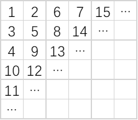
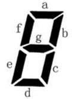

# 蓝桥杯2020省赛B组第二轮
## 目录 :clipboard:

-   [A 门牌号](#A-门牌号)
-   [B 既约分数](#B-既约分数)
-   [C 蛇形填数](#C-蛇形填数)
-   [D 跑步锻炼](#D-跑步锻炼)
-   [E 七段码](#E-七段码)

## A 门牌号
小蓝要为一条街的住户制作门牌号。
这条街一共有2020 位住户，
门牌号从1 到2020 编号。
小蓝制作门牌的方法是先制作0 到9 这几个数字字符，
最后根据需要将字符粘贴到门牌上，
例如门牌1017 需要依次粘贴字符1、0、1、7，
即需要1 个字符0，2 个字符1，1 个字符7。
请问要制作所有的1 到2020 号门牌，总共需要多少个字符2？

### 答案
```plt
624
```
-   [python代码](A_house_number.py)
-   [C代码](A_house_number.c)

## B 既约分数

### 问题描述
如果一个分数的分子和分母的最大公约数是1，
这个分数称为既约分数。
例如，`3/4` , `5/2` , `1/8` , `7/1`都是既约分数。
请问，有多少个既约分数，
分子和分母都是`1` 到`2020` 之间的整数（包括`1`和`2020`）？

### 答案提交
这是一道结果填空的题，你只需要算出结果后提交即可。本题的结果为一个整数，在提交答案时只填写这个整数，填写多余的内容将无法得分。

### 我的答案
```plt
2481215
```

-   [python代码 B_reduced_fraction](B_reduced_fraction.py)


## C 蛇形填数
本题总分：10 分

### 问题描述

如下图所示，
小明用从1 开始的正整数“蛇形”填充无限大的矩阵。



容易看出矩阵第二行第二列中的数是5。请你计算矩阵中第20 行第20 列的数是多少？

### 答案提交
这是一道结果填空的题，你只需要算出结果后提交即可。本题的结果为一
个整数，在提交答案时只填写这个整数，填写多余的内容将无法得分。

### 我的答案
```plt
761
```
-   [python代码: C_snake_numbering.py](./C_snake_numbering.py)

## D 跑步锻炼

### 问题描述
小蓝每天都锻炼身体。
正常情况下，小蓝每天跑 1 千米。
如果某天是周一或者月初（1 日），为了
激励自己，小蓝要跑 2 千米。
如果同时是周一或月初，小蓝也是跑 2 千米。
小蓝跑步已经坚持了很长时间，
从 2000 年 1 月 1 日周六（含）到 2020 年
10 月 1 日周四（含）。
请问这段时间小蓝总共跑步多少千米？

### 答案提交
这是一道结果填空的题，你只需要算出结果后提交即可。
本题的结果为一个整数，
在提交答案时只填写这个整数，
填写多余的内容将无法得分。

### 我的答案
```plt
8879
```

-   [python 代码 D_running_exercise](./D_running_exercise.py)

## E 七段码

本题总分：10 分

### 问题描述
小蓝要用七段码数码管来表示一种特殊的文字。



上图给出了七段码数码管的一个图示，
数码管中一共有7 段可以发光的二极管，
分别标记为a, b, c, d, e, f, g。
小蓝要选择一部分二极管（至少要有一个）发光来表达字符。
在设计字符的表达时，
要求所有发光的二极管是连成一片的。
例如：b 发光，其他二极管不发光可以用来表达一种字符。
例如：c 发光，其他二极管不发光可以用来表达一种字符。
这种方案与上一行的方案可以用来表示不同的字符，
尽管看上去比较相似。
例如：a, b, c, d, e 发光，
f, g 不发光可以用来表达一种字符。
例如：b, f 发光，其他二极管不发光则不能用来表达一种字符，
因为发光的二极管没有连成一片。
请问，小蓝可以用七段码数码管表达多少种不同的字符？

### 答案提交
这是一道结果填空的题，
你只需要算出结果后提交即可。
本题的结果为一个整数，在提交答案时只填写这个整数，填写多余的内容将无法得分。


## 参考
-   [2020蓝桥杯C++B组省赛第二场个人感受和个人题解](https://blog.csdn.net/weixin_45590872/article/details/109136495)
-   [2020蓝桥杯省赛B组C++(第二场)真题](https://blog.csdn.net/weixin_44723496/article/details/109403580#t1)
