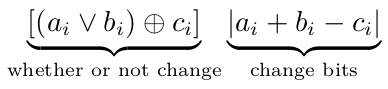

# C, 0ms, using only one express to count
-   [link](https://leetcode.com/problems/minimum-flips-to-make-a-or-b-equal-to-c/discuss/493305/C-0ms-using-only-one-express-to-count)
```c
int minFlips(int a, int b, int c) {
  int ai, bi, ci, count = 0, _;
  while (a || b || c) {
    ai = a & 1;
    bi = b & 1;
    ci = c & 1;
    if ((_ = ai + bi - ci) < 0) {
      _ *= -1;
    }
    count += ((ai | bi) ^ ci) * (_);
    c >>= 1;
    b >>= 1;
    a >>= 1;
  }
  return count;
}
```

The key is
-   (ai **or** bi)  **xor** ci
It determine whether or not to replace, obviously,
when it yield `1`, They need change.
-   `|(ai+bi-ci)|`
The number we need change can be abstract by the following table

| a   | b   | c   | a **or** b | change |
|:--- |:--- | --- | ---------- | ------ |
| 0   | 0   | 0   | 1          | 0      |
| 0   | 0   | 1   | 0          | 1      |
| 0   | 1   | 0   | 1          | 1      |
| 0   | 1   | 0   | 1          | 0      |
| 1   | 0   | 0   | 1          | 1      |
| 1   | 0   | 1   | 1          | 0      |
| 1   | 1   | 0   | 1          | 2      |
| 1   | 1   | 1   | 1          | 0      |



Runtime will be 4 ms using `fabs()`,so I cahnge it.

-   [fabs()](https://leetcode.com/submissions/detail/298406966/)
-   [more details](https://leetcode.com/submissions/detail/298407923/)
